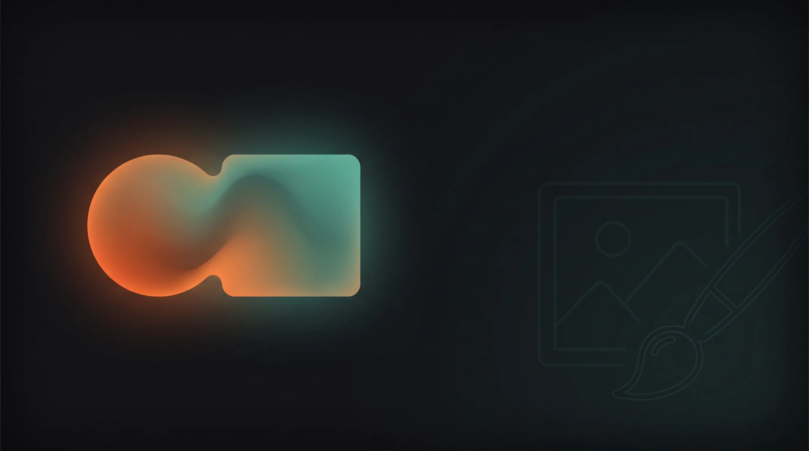

<h1 align="center">vivMorph</h1>

<p align="center"><strong>An AI image studio in your pocket — create, combine and mask-edit images in seconds, powered by Venice AI.</strong></p>

<p align="center">
  
</p>

<p align="center">
  Mobile-first PWA · Buildless · Netlify Functions · Images stay on your device
</p>

---

## ✨ Features

| | |
|---|---|
| 🎨 **Create** — text to image with live model, aspect-ratio and resolution pickers. | 🧬 **Combine** — blend 1–3 photos into one image with a combine-capable model. |
| 🖌️ **Edit + Mask** — paint exactly what should change; everything else stays pixel-for-pixel. | ⚡ **Mercury optimizer** — optional one-tap prompt rewrite with a preview before it's applied. Never automatic. |
| 📡 **Live model catalog** — models, prices and limits come from the Venice API at runtime, never hardcoded. | 🔍 **Upscale & background removal** — one tap on any result. |
| 📱 **Mobile-first PWA** — installable, thumb-zone tab bar, safe-area aware, works offline for the shell. | 💾 **On-device history** — every image is kept in IndexedDB on your device; nothing is stored on a server. |

---

## 🧭 How to use

### Create
1. Open the **Create** tab and describe the image you want.
2. Pick an aspect ratio and a model (the price is shown in the picker).
3. Tap **Generate**. Download it, iterate on it, or send it to Edit.

### Combine
1. Open **Combine** and add 1–3 images (up to 25 MB each, HEIC supported).
2. Describe how they should blend, pick a combine-capable model, and tap **Blend**.

### Edit with a mask — step by step
The mask is how you tell vivMorph *exactly* which part of a photo to change.

1. **Open Edit** — tap the **Edit** tab and drop, paste or tap to upload a photo.
2. **Turn on the mask** — tap **Paint mask** under the photo. The brush tools appear.
3. **Paint the area** — brush over the part you want changed. Use **Eraser** to pull back, **Clear** to start over, and the **Size** slider to change brush width.
4. **Describe the change** — type what the painted area should become (e.g. *"a red vintage bicycle"*), choose an edit model, and tap **Apply Edit**.
5. **Compare** — press and hold the result to see the original, then **Download**, **Upscale 2x**, **Remove BG** or **Iterate**.

> **How masking works:** Venice's `/image/edit` endpoint has no mask input. When a mask is painted, the whole photo is sent at its original framing, and the result is blended back on the client through a feathered copy of your mask — so only the painted area changes.

---

## 🏗️ Stack & architecture

vivMorph is **intentionally buildless**: a static front-end that deploys as-is, plus a handful of serverless proxies that keep the API key off the client.

```
Browser (PWA)                         Netlify                         Venice AI
┌───────────────────────┐   POST    ┌──────────────────────────┐     ┌──────────────┐
│ index.html (the app)  │ ────────▶ │ /.netlify/functions/*    │ ──▶ │ api.venice.ai│
│ styles.css            │           │ adds VENICE_AI_API_KEY   │     │   /api/v1/*  │
│ sw.js · manifest.json │ ◀──────── │ server-side              │ ◀── │              │
│ IndexedDB (history)   │           └──────────────────────────┘     └──────────────┘
└───────────────────────┘
```

| Path | Role |
|---|---|
| `index.html` | The entire app: four-tab UI (Create / Combine / Edit / About), model pickers, Mercury optimizer, mask painting, compare, history. |
| `styles.css` | Precompiled Tailwind output, served as a plain static file. `src/styles.css` is its source. |
| `sw.js` | Service worker: stale-while-revalidate app shell, offline fallback, never caches API calls. |
| `manifest.json` | PWA install manifest (icons in `assets/`). |
| `assets/` | Logo, app icons and README hero. |
| `netlify/functions/` | Serverless proxies to the Venice API (below). |
| `netlify.toml` | Publish dir `.`, no build command, SPA redirect, security headers. |

**Netlify functions** (each called as `/.netlify/functions/<name>`):

| Function | Venice endpoint | Used by |
|---|---|---|
| `image-generate.js` | `POST /image/generate` | Create |
| `image-multi-edit.js` | `POST /image/multi-edit` | Combine |
| `image-edit.js` | `POST /image/edit` | Edit (masked and unmasked) |
| `chat-completions.js` | `POST /chat/completions` | Mercury prompt optimizer |
| `list-models.js` | `GET /models?type=…` | Live model catalogs |
| `upscale.js` | `POST /image/upscale` | Upscale 2x |
| `background-remove.js` | `POST /image/background-remove` | Remove BG |

### Offline & caching
- The service worker precaches the shell (`index.html`, `styles.css`, `manifest.json`, logo and icons) and serves it **stale-while-revalidate** — instant loads, refreshed in the background.
- Requests to `/.netlify/functions/*` and `/api/*` are **never cached** and always hit the network.
- With no connection, navigations fall back to the cached shell (or a small offline page on first visit).

### Persistence
Generated images and the full history are stored **on-device in IndexedDB** (database `vivmorph`), so they survive reloads and cold starts. There is no backend database and no server-side image storage — clearing site data clears your history.

---

## 🔑 Environment variables

| Name | Required | Where | Purpose |
|---|---|---|---|
| `VENICE_AI_API_KEY` | ✅ | Netlify → Site configuration → Environment variables | Venice API key used by every function in `netlify/functions/`. |
| `VENICE_API_KEY` | optional | same | Fallback name — read only if `VENICE_AI_API_KEY` is not set. |

The key is only ever read server-side (`process.env.VENICE_AI_API_KEY || process.env.VENICE_API_KEY`). It is never sent to the browser. Never commit it — `.env` is git-ignored.

---

## 💻 Local development

There is no build step. To run the app *and* the functions locally, use the Netlify CLI (it is not a project dependency — run it via `npx`):

```bash
git clone https://github.com/vivmuk/vivMorph.git
cd vivMorph
echo "VENICE_AI_API_KEY=your-venice-key" > .env   # git-ignored
npx netlify-cli dev
```

`netlify dev` serves the repo root, mounts `netlify/functions/` at `/.netlify/functions/*` and loads `.env`. Open the URL it prints.

- **UI-only tweaks:** any static file server works (e.g. `python3 -m http.server`), but the Venice calls will fail without the functions.
- **Service worker:** it only registers over `https:` — on `localhost` it stays off, so you always see fresh files while developing.
- **Styles:** Tailwind is precompiled. If you change classes or `src/styles.css`, regenerate `styles.css` and commit it:
  ```bash
  npm install
  npm run build:css
  ```

---

## 🚀 Deploy to Netlify

1. Create a Netlify site from this repo (or `npx netlify-cli deploy --prod` from the repo root).
2. Build settings come from `netlify.toml`: **publish directory `.`**, **no build command**, functions in `netlify/functions/`.
3. Add `VENICE_AI_API_KEY` under **Site configuration → Environment variables**, then trigger a redeploy so the functions pick it up.
4. After each release that changes the shell, bump `VERSION` in `sw.js` so installed clients drop the old cache.

---

## 📐 Model notes

- Model lists, prices, aspect ratios, prompt limits and resolution tiers come from `GET /models` at runtime — new Venice models appear automatically, retired ones disappear.
- Defaults: `grok-imagine-image-2-0` for Create, `grok-imagine-image-2-0-edit` for Edit and Combine.
- Single-image edit sends `model`; multi-edit sends `modelId`, per the Venice API contract.
- Combine only lists models whose catalog entry has `combineImages: true`.
